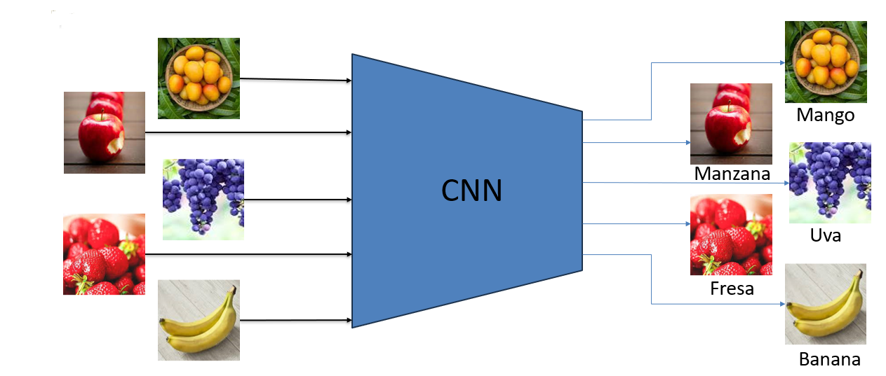
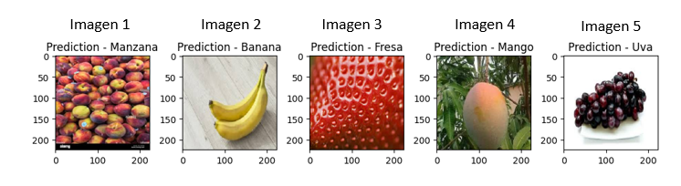
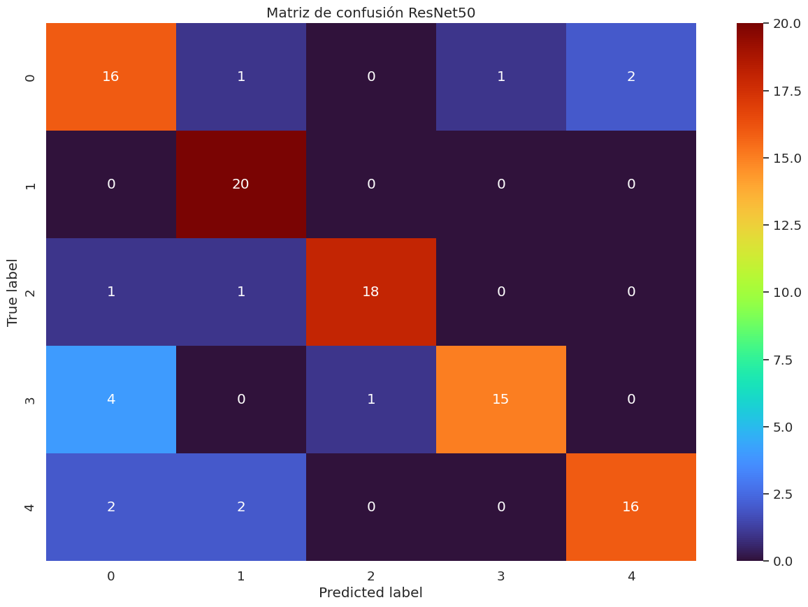
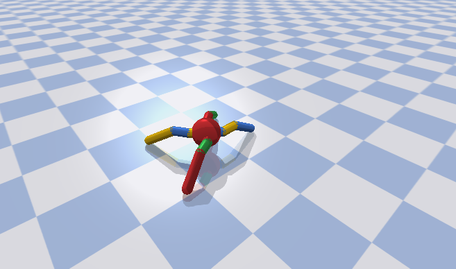
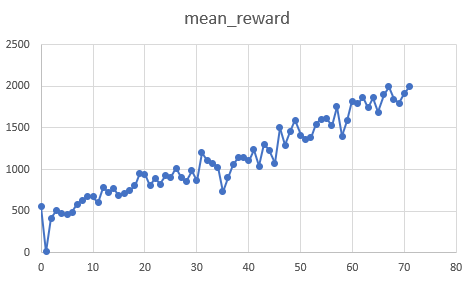
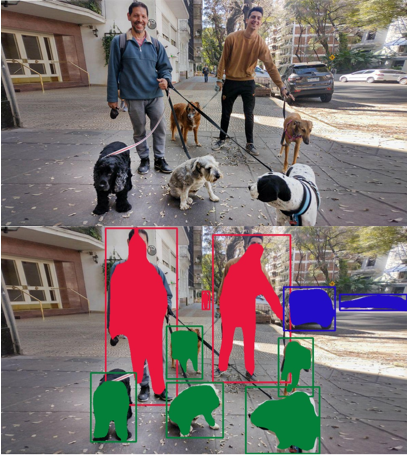
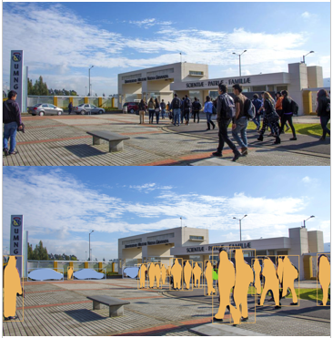

# Applications Deep Learning Robotics
_Repositorio para mi trabajo de grado: Deep learning en ingenieria mecatronica. Incluye codigo y recursos para clasificacion de imagenes, segmentacion de imagenes y aprendizaje por refuerzo._

## About
Este repositorio se encuentran las difertentes apliaciones realizadas en mi trabajo de grado de ingenieria en mecatronica, las cuales son enfocadas en inteligencia artificial, especificamente en machine learning/deep learning.
El trabajo de grado recibe el titulo de: Manual teórico-práctico de aprendizaje profundo aplicado a problemas de ingeniería mecatrónica.
Se aplican diferentes tecnicas de machine learning como:
* Clasificacion de imagenes.
* Aprendizaje por refuerzo.
* Segmentacion de imagenes.

Por otro lado se explican diversos conceptos teoricos del machine learning como puede ser:
* Redes Neuronales.
* Redes Neuronales convolucionales (CNN).
* Arquitecturas de CNN.
* Transferencia de aprendizaje.

## Tecnologias
Se implementaron diversas tecnologias en el lenguaje de **Python**, usando varias librerias, como lo son:
* Keras
* TensorFlow
* CV2
* numpy
* Stable_baseline3

## Uso
Para el uso de cada una de las aplicaciones es necesario instalar los paquetes respectivos que se importan.
### ImagenClasification_TransferLearning
* TensorFlow
* Pandas
* matplotlib
* Numpy
* seaborn
  
### Motion_control-Reinforcement_learning
* gym
* torch
* stable_baseline3
* pybullet
  
### Environment_Identification-Image_Segmentation
* Numpy
* CV2
* frozen_inference_graph_coco.pb
* mask_rcnn_inception_v2_coco_2018_01_28.pbtxt

Los dos ultimos son modelos ya entrenados de COCO disponibles [aqui](https://github.com/methylDragon/opencv-python-reference/tree/master/Resources/Models/mask-rcnn-coco)

## Resumen
En los últimos años, la inteligencia artificial ha experimentado un crecimiento notable, evidenciando avances en una variedad de sectores y transformando la vida cotidiana, tareas e industrias. Uno de los campos que ha sido especialmente impactado es el de la robótica, con avances notables como la robótica colaborativa, la automatización de procesos y los vehículos autónomos. La ingeniería en mecatrónica es una disciplina altamente representativa de la automatización y los robots; sin embargo, hasta ahora ha tenido un enfoque limitado en cuanto a la inteligencia artificial, lo cual limita las oportunidades académicas y laborales que el dominio de la inteligencia artificial podría ofrecer a estos profesionales. Como respuesta a esta brecha, este documento presenta el desarrollo de un manual teórico-práctico que presenta tres aplicaciones distintas potenciadas por la inteligencia artificial. Estas aplicaciones son extremadamente útiles para la implementación de robots y en la ingeniería mecatrónica. El objetivo es permitir que cualquier profesional interesado en el área pueda adquirir los conocimientos necesarios para desenvolverse en este campo. Las aplicaciones específicas incluyen la clasificación de imágenes, la segmentación semántica de imágenes para la detección de objetos en entornos y el
aprendizaje por refuerzo para el desarrollo de movimientos de un robot.

Un pequeño vistazo a cada aplicacion es:
### Clasificacion de imagenes - Tranferencia de aprendizaje
Creacion de un clasificador de imagenes entrenado con frutas de un dataset disponible [aqui](https://www.kaggle.com/datasets/utkarshsaxenadn/fruits-classification).
Donde se le ingresa una imagen de fruta y el resultado es una casificacion one hot coding de las 5 posibles clasificaciones:

En este ejemplo se le ingreso 5 frutas de cada clasificacion y se retorna correctamente cada clase a la perteneciente.

Por ultimo se realizo la predeccion con un dataset de prueba para comprobar el resultado de cada modelo y se obtuvo la matriz de confusion para cada uno de ellos, aqui se puede observar la del modelo ResNet50:

En esta se puede observar que la linea de identidad presenta la mayoria de predicciones mostrando un correcto entrenamiento del modelo.

### Control de movimiento - aprendizaje por refuerzo
En esta aplicacion se entreno un robot en un ambiente virtual en el cual el agente (robot hormiga) no tiene ninguna instrucion de como realizar movimiento alguno y se le recompensa cuando realiza un movimiento que le permita cambiar su posicion en el ambiente.

Al cabo de muchas iteraciones y de modificar los hiper parametros el robot logra desarrollar el metodo de movimiento para desplazarse rapidamente. En la siguente imagen se puede ver la evolucion del aprendizaje y el "puntaje" obtenido el robot en cada iteracion demostrando como el robot fue aprendiendo:

### Identificacion de ambiente - Segmentacion de imagenes
En esta aplicacion se identifico los componentes del ambiente basados en el modelo mask-RCNN inception, entrenado con el dataset COCO. En la imagen se puede ver como apartir de una imagen el modelo es capaz de identificar los diferentes objetos y atribuirles una categoria con el color de mascara:

Se realizo la implementacion usando CV2 y modelo ya entrenado, aqui se puede ver la segmetacion en una imagen de la universidad militar Nueva granada.

## Documento 📖

Puedes encontrar el documento de trabajo de grado en el siguente link: [UMNG](https://repository.unimilitar.edu.co/items/2895e290-f05f-44e9-9e1a-34f3fc5c3e97)

## Tutor ✒️

Este proyecto se realizo con la tutoria de
* **Nelson Fernando Velasco Toledo** - Docente de la Universidad Militar Nueva Granada [GitHub](https://github.com/nelsonfvt) [Linkedin](https://www.linkedin.com/in/nelson-fernando-velasco-toledo-1a6b6b249/)

[MaickMos](https://github.com/Maickmos)
